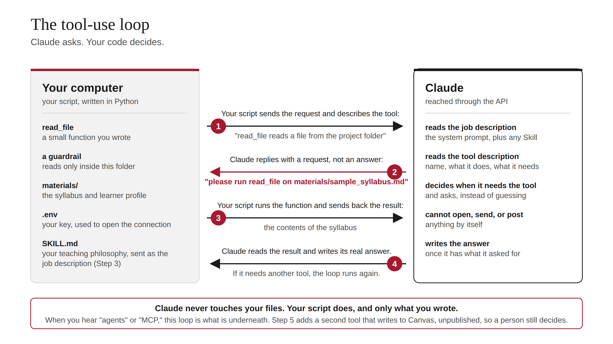

# How This Lab Works

The one-page explanation. Read this before the steps if you want to understand what is happening, not just follow along.

## The big picture

When you use Claude in the app, Anthropic built the app and you type into it. The Claude Developer Platform is the other door: it lets anyone write their own program that talks to Claude. The API is that door. Your program sends Claude a message, Claude sends back a reply, and your API key is the ID badge that says "this is my account, bill me a few cents." Everything people build on Claude, from customer-service bots to coding agents, is a program talking through that same door.

This lab takes you from "I chat with Claude" to "I built a small program that uses Claude as a working partner, and I understand every piece of it." The thing the program does (redesign a week of a course) is deliberately something you already know how to judge. Your teaching expertise is the tool that matters most.

## Three ideas, one per step

Everything on the platform is built from three ideas: messages, tools, and Skills. Each step adds exactly one.

**Step 0 sets up the workshop.** Python is the language. The "virtual environment" is a clean drawer so the lab's supplies do not mix with anything else on your computer. The two libraries are `anthropic` (the phone line to Claude) and `python-dotenv` (a reader for the `.env` file). The `.env` file is a locked drawer for your key: the code says "get the key from the drawer" instead of containing the key, so the key never ends up on GitHub.

**Step 1 is the smallest possible conversation.** One message in, one reply out. Five words are the whole vocabulary: `client` is the connection, `model` is which Claude, `system` is the job description, `messages` is the conversation so far, `response` is what came back. This is what the chat app does behind the scenes every time you press enter. The system prompt, where you describe the colleague you want, is the biggest lever you have.

**Step 2 adds a tool. This is what people mean by "agents."** Claude cannot touch your computer. It cannot open a file, send an email, or post to Canvas. What it can do is ask. A tool is a small function you wrote, plus a plain-English description of what it does. You hand Claude the description. When Claude decides it needs the file, instead of answering it sends back a request: "please run read_file on the syllabus." Your script runs the function, sends the contents back, and Claude finishes its answer. Picture a new colleague with no badge for the building: they ask you to pull the syllabus from the shared drive, you do it, they read it, then they give you their real thinking. Your code decides what is allowed. The guardrail in `lab_helpers.py` only reads files inside this folder. MCP and agent frameworks are elaborations of this exact loop.

**Step 3 adds a Skill: a teaching philosophy in a form Claude can follow.** A `SKILL.md` is a plain-text handout: the order to work in, the frameworks to apply, the checks to run, the things never to do. The lab reads that file and places it in the system prompt, so Claude starts the conversation already briefed the way you would brief a new adjunct. Nothing else changes from Step 2. You run it twice on purpose. On the first run Claude reads the syllabus and then stops to ask who the learners are, because the Skill says "learners first." That is proof the Skill changed behavior. On the second run it has the learner profile and produces the full module with design notes. The reflection asks you to find the one decision only a teacher would catch and trace it back to a line in the Skill. Judgment becomes instructions becomes better output. That loop is the work.

**Step 4 is transfer.** Your syllabus, your learners, your Skill. Nothing new to learn; the point is that you now own it.

**Step 5 adds a second tool, and now the loop changes something in the world.** The `create_canvas_page` tool sends the finished page to a Canvas course. Same loop as Step 2, except this tool writes instead of reads, which is why it creates the page unpublished. That one line, `published: false`, is where the human stays in charge. It is also why your script, not Claude, holds the Canvas token.

**The bonus step is the same Skill by a different route.** Instead of pasting the file into the prompt, you upload the folder to Anthropic once, get an id, and reference it from any request. That is how a department would manage a shared Skill centrally. Two delivery methods, one Skill, so you can see the tradeoff.

**Dry-run mode** is a pretend Claude built into `lab_helpers.py`. It answers with canned replies and fake tool requests, so anyone can walk the whole lab and watch the shape of the loop without a key or a bill. That is a teaching decision, not a technical one.

## Why it is built this way

One new idea per step. A checkpoint you can verify yourself at every step. A reflection that hands the judgment back to you. The lab follows the same design principles it teaches, because the argument underneath it is simple: the quality of what AI produces in a classroom is decided by the expertise of the person directing it, not by their technical fluency.
